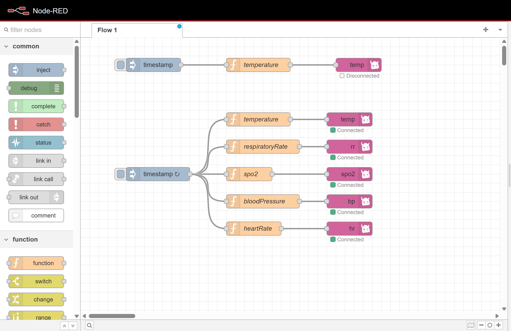
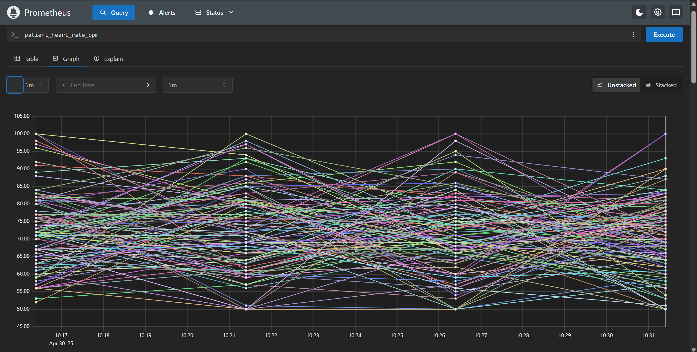
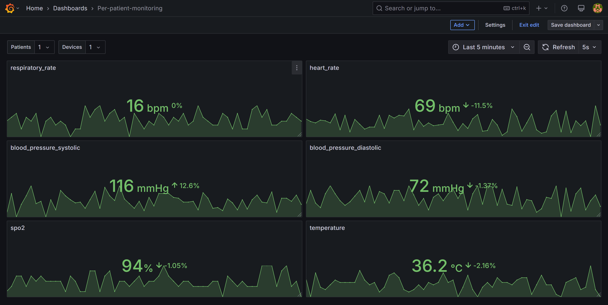
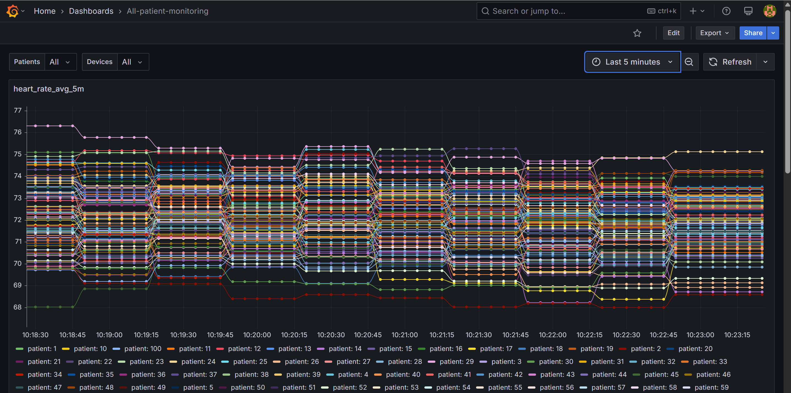
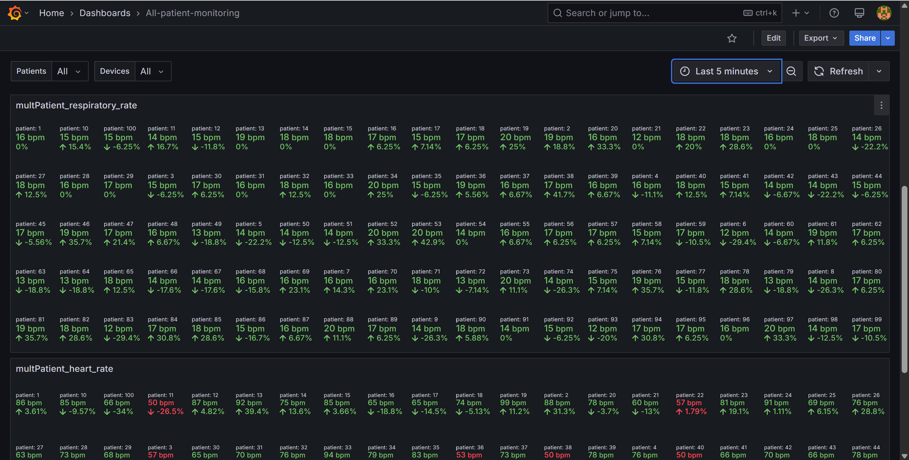

# Healthcare Telemetry Monitoring System

## Summary
This project simulates a full end-to-end healthcare monitoring pipeline, from device telemetry generation through secure messaging, metric collection, and dashboard visualization. It uses realistic, statistically-driven Node-RED simulators, a RabbitMQ 3-node cluster secured with TLS/mTLS, a Spring Boot consumer instrumenting Micrometer MultiGauge metrics, Prometheus for scrape and recording rules, and Grafana for interactive dashboards. Everything is orchestrated via Docker Compose for easy local development and testing.

## High-level architecture
                                    +-----------------------+
                                    |  /dev-ops/certs       |
                                    |  (CA & PKI artifacts) |
                                    +----------┬------------+
                                               │
                                         mounts│
                                               v
                                    ┌─────────────────────────┐
                                    │   Docker Compose        │
                                    │ (Single bridge network, │
                                    │  config & volume mounts)│
                                    └──────────┬──────────────┘
                                               │
                  ┌────────────────────────────┼────────────────────────────┐
                  │                            │                            │
                  ▼                            ▼                            ▼
        ┌─────────────────┐           ┌───────────────────┐       ┌───────────────────┐
        │ Patient Devices │           │    Node-RED       │       │ RabbitMQ Cluster  │
        │ (100 simulated  │─Telemetry───► Function Nodes  ──AMQPS──► 3-node, HA, TLS/ │
        │  patients)      │           │ (heart, BP, SpO₂, │       │ mTLS secured      │
        └─────────────────┘           │  resp, temp sims) │       └─────────┬─────────┘
                                      └───────────────────┘                 │
                                                                            │
                                                                            │
                                                           ┌────────────────▼─────────────────┐
                                                           │    Spring Boot Consumer          │
                                                           │  • Spring AMQP                   │
                                                           │  • Micrometer MultiGauge metrics │
                                                           └────────────────┬─────────────────┘
                                                                            │
                                                                            │ HTTPS scrape
                                                                            ▼
                                                           ┌─────────────────────────────┐
                                                           │        Prometheus           │
                                                           │ • /actuator/prometheus      │
                                                           │ • Recording rules (avg/sum) │
                                                           └────────────────┬────────────┘
                                                                            │
                                                                            │ Datasource
                                                                            ▼
                                                            ┌────────────────────────────┐
                                                            │        Grafana             │
                                                            │ • YAML-provisioned         │
                                                            │   dashboards & datasources │
                                                            │ • Template vars & regex    │
                                                            └────────────────────────────┘

### Node-red - device simulator

### Prometheus

### Grafana - per patient, base on patientID

### Grafana - all patient, base on pre-rule

### Grafana - all patient

## Features

- **Multi-Device Simulation**
    - Five Node-RED Function nodes generate realistic heart rate, blood pressure, SpO₂, respiratory rate, and temperature data for 100 simulated patients.

- **Secure Messaging with RabbitMQ**
    - Three-node RabbitMQ cluster (v3.11) using mutual TLS (mTLS) for encrypted, authenticated AMQP connections.

- **Spring Boot Consumer & Micrometer**
    - Dynamically registers MultiGauge metrics (`patient_heart_rate_bpm`, `patient_blood_pressure_systolic_mmHg`, etc.) tagged by patient and device.

- **Prometheus Scraping & Recording Rules**
    - `/actuator/prometheus` endpoint scraped over HTTPS; precomputes averages and sums via recording rules for ultra-fast queries.

- **Grafana Dashboards**
    - Provisioned via YAML with template variables (`$patients`, `$devices`, `$deviceNum`), bottom-positioned legends, and device-ID regex extraction for user-friendly filtering.

- **Dev-Ops Ready**
    - Single `docker-compose.yml` brings up all services; `/dev-ops/certs` houses a private CA and PKI artifacts; step-by-step guides for cert generation included.

## Technology Stack

- **Node-RED** (`node-red/node-red`): JavaScript-based flow editor for simulating device telemetry, using `@stormpass/node-red-contrib-amqp` for AMQPS.
- **RabbitMQ** (`rabbitmq:3.11-management`): High-availability message broker; TLS on 5671, Prometheus exporter on 15692, HTTP UI on 15672.
- **Spring Boot**: Java microservice consuming telemetry, using Spring AMQP and Micrometer for metric instrumentation.
- **Prometheus** (`prom/prometheus`): Pull-based monitoring; configured with TLS for secure scraping and custom recording rules (`recording_rules.yml`).
- **Grafana** (`grafana/grafana`): Interactive dashboards; provisioned datasources and dashboards via YAML; supports regex-driven template variables.
- **Docker Compose**: Orchestrates all containers on a single bridge network; mounts configs, certs, and data volumes for persistence.
- **OpenSSL & WSL**: PKI tooling in Windows WSL for generating a private CA, server and client certs, Java keystore/truststore, and verifying mTLS.

